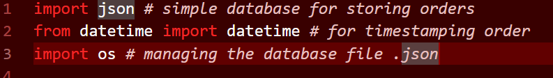

# Rushmore_Pizzeria_App
Developing a CLI application for Pizza order's for RushMore

## Libraries Used
* `json` - Simple database for storing orders.

* `datetime` - For orders timestamp.

* `os` - For clearing the console screen.

